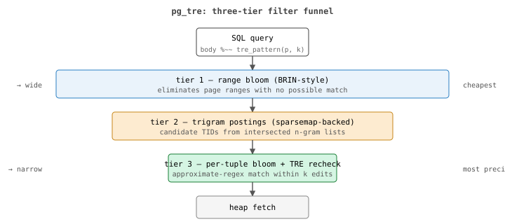

+++
title = "pg_tre: approximate regex as a real Postgres index AM"
date = "2026-05-26"
draft = false
description = "A native USING tre index access method with three-tier filtering, WAL coverage, and Levenshtein-distance recheck. Sub-millisecond on tens of thousands of rows."
[taxonomies]
tags = ["postgres","pg_tre","indexing","regex","extensions"]
+++

PostgreSQL ships excellent text-search primitives.  `pg_trgm` gives
you trigram similarity and accelerated `LIKE`.  The built-in
full-text-search machinery (`tsvector`/`tsquery`) gives you
linguistic search with stemming, stopwords, and ranking.  `pgvector`
and friends give you semantic similarity over embeddings.  Each is
strong at the thing it was built for.

What none of them do is *approximate regular expression* matching
through an index.  The query "find rows whose body matches this
regex within *k* edits" — the `ripgrep`-with-`-z` shape — is not
something the existing extensions can answer with index acceleration.
[`pg_tre`](https://codeberg.org/gregburd/pg_tre) is the index access
method that fills that gap.

## what approximate regex actually means

Most people who say "regex" mean PCRE-like patterns: character
classes, alternation, anchors, repetition, capturing groups.  The
standard semantics are exact: a string either matches the pattern or
does not.

*Approximate* regex extends the model with an edit budget.  The
operator I use, borrowed from
[Ville Laurikari's TRE library](https://github.com/laurikari/tre),
attaches a `{~k}` count to a sub-expression and asks "match within at
most *k* insertions, deletions, or substitutions."  The full
expression composes those budgets:

```sql
-- "approximately the word `error` (one edit allowed)
--  followed by anything followed by the literal 42x range
--  (zero edits allowed)", overall edit budget 1.
SELECT id
FROM   docs
WHERE  body %~~ tre_pattern('(error){~1}.*(42[0-9]){~0}', 1);
```

This is the operator nobody else in the Postgres extension ecosystem
exposes through an index, and it is exactly the shape log-analytics
and code-search workloads need.

## why a real index AM and not a UDF

The lazy way to ship this would be a `tre_amatch(text, pattern, k)`
function and tell people to add it to a `WHERE` clause.  That works
for tens of rows.  It does not work for millions, because the planner
has no way to avoid the heap scan: every row has to be loaded and
the function evaluated on its body.

A real index AM lets the planner avoid the heap scan when the index
can prove a row cannot match.  `pg_tre` registers
`IndexAmRoutine` under the name `tre`, owns rmgr id 140 for WAL
coverage, supports `REINDEX CONCURRENTLY`, integrates with `VACUUM`,
and survives crash recovery and streaming replication the same way
btree does.  None of that is glamorous; all of it is what an index
AM has to do to be a first-class citizen.

## the three-tier filter funnel

The hard problem is making the index *fast*.  Approximate regex
matching is intrinsically expensive: the NFA simulation has a state
space that grows with the edit budget, so you cannot afford to run
it on every candidate row.  The architecture is a funnel of cheap-
to-expensive filters, each more precise than the last:



  - **Tier 1 — range bloom.**  A BRIN-style summary per page range
    asks "does this page range contain *any* trigram from the
    pattern's required set?"  When the answer is no, the entire
    page range is skipped without a heap fetch.  Cheap, broad,
    eliminates most of the table on selective queries.

  - **Tier 2 — trigram postings.**  A trigram inverted index where
    the postings layer is [`sparsemap`](https://codeberg.org/gregburd/sparsemap),
    not GIN's array-of-itempointers.  The intersection of the
    required-trigram postings produces the candidate TID set.
    Sparsemap is the right substrate here because trigram postings
    in real corpora hit its best case — long runs of contiguous
    TIDs, because rows that share a trigram cluster on disk.

  - **Tier 3 — per-tuple bloom + TRE recheck.**  A small bloom
    filter per indexed tuple eliminates obvious non-matches in
    constant time.  Survivors are handed to the TRE library for
    the full Levenshtein-distance recheck against the pattern.

The three tiers compose so that the executor never reads the heap
for rows that earlier tiers have eliminated.  On the queries that
return a handful of rows out of millions, the result is sub-
millisecond latency.

## what makes it fit into PostgreSQL cleanly

A custom index AM is an awkward thing to ship.  It can break in
ways btree cannot, because nothing else has trodden the path.  Three
properties matter for being able to deploy `pg_tre` in production
the way you would deploy `btree_gin`:

  - **Custom rmgr (id 140) with full WAL coverage.**  Every change
    to the index is journalled and replayed; crash recovery and
    streaming replication just work.  Validated by TAP tests.

  - **DoS protection by construction.**  Configurable caps on NFA
    state count, compile time, and per-match runtime mean a
    pathological pattern cannot stall the executor indefinitely.
    The defaults are tuned for log-analytics shapes.

  - **UTF-8 codepoint trigrams, not byte trigrams.**  CJK,
    accented characters, and emoji index correctly; ASCII pays
    zero overhead.  The trigram extraction is done at the
    codepoint level so a trigram never spans a UTF-8
    continuation byte.

## where pg_tre sits next to what you already have

pg_tre is meant to *complement* the existing search extensions, not
replace them.

  - `pg_trgm` (GIN/GiST) is the right tool for exact regex,
    `LIKE`, and trigram-set similarity.  `pg_trgm %` is Jaccard
    similarity over trigram sets, which is *not* the same as
    edit distance — two strings with overlapping trigrams can
    score "similar" even when their Levenshtein distance is
    huge.  Use `pg_trgm` when you need exact-substring or
    `LIKE` acceleration.

  - `tsvector` / `tsquery` is the right tool for natural-language
    prose, where stemming and stopwords matter.  pg_tre is
    language-agnostic, which is a feature for identifiers, SKUs,
    error codes, and log lines, and a non-feature for "running"
    matching "run".

  - `pgvector` / `pgvectorscale` is the right tool for *semantic*
    similarity over embeddings.  Orthogonal to pg_tre — meaning
    vs. lexical structure.  The two compose naturally as a
    hybrid filter: pre-filter lexically with pg_tre, rank
    semantically with pgvector.

  - `pg_tre` is the right tool for approximate regex with
    explicit edit budgets and full regex semantics composable
    with the `{~k}` operator.  Nothing else in the ecosystem
    answers the same question through an index.

## a few things only pg_tre does well

Not every query has an answer in approximate regex.  The shapes
where pg_tre is the right tool are specific:

  - Log-analytics queries against unstructured payloads where the
    pattern was typed by an operator under time pressure and
    contains typos.
  - Code-search queries with planned wildcards plus tolerated
    edits ("find calls to `*_alloc(...)` with one edit").
  - Identifier search across heterogeneous corpora where the
    spelling is unstable (drug names, gene symbols, error codes,
    SKU prefixes).
  - Anything where you have been writing custom Python with
    `regex.findall` plus `Levenshtein.distance` and want it to be
    a single SQL predicate.

## status

v1.1.1.  Same on-disk format as 1.0.0 and 1.1.0; no re-index
required between versions.  MIT-licensed.  Built against
PostgreSQL 18, but the AM design is forward-compatible.  Tested on
real corpora — Postgres archives, dbpedia, a sample of the Linux
kernel mailing-list — and the numbers in
[`bench/`](https://codeberg.org/gregburd/pg_tre/src/branch/main/bench)
are repeatable.

The pattern parser is built on
[Lime](https://codeberg.org/gregburd/lime), my runtime-extensible
LALR(1) parser generator; that is its own post.  The repo is at
<https://codeberg.org/gregburd/pg_tre> with a GitHub mirror.
