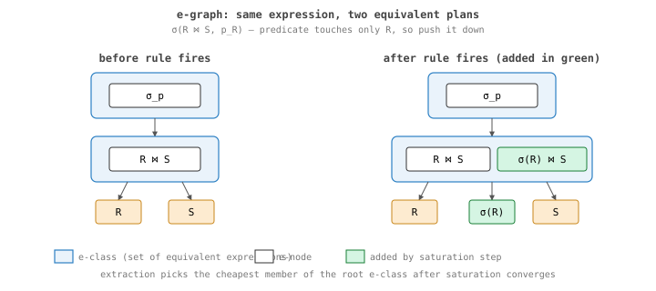

+++
title = "Ra, part 2: equality saturation with egg"
date = "2026-07-13"
draft = true
description = "Why exploring all equivalent plans simultaneously beats committing to a sequence of rewrites."
[taxonomies]
tags = ["ra","egg","e-graphs","query-optimization","series:ra"]
+++

**Status: draft, scaffolded by an agent. Prose to be written by me.**

## thesis

Classic optimizers commit to a sequence of rewrites; that's how you lose the
better plan. Equality saturation, via the `egg` library, explores all
equivalent plans simultaneously and extracts the cheapest *after* the search
converges (or you give up). What that buys you, what it costs, and why I
picked egg specifically over alternatives.

## outline

- [ ] The e-graph data structure in 5 minutes (e-class, e-node, congruence
      closure).
- [ ] The phase-ordering problem that motivates saturation.
- [ ] Why `egg` (Rust, fast, well-maintained, paper-proven, easy FFI to my
      planner).
- [ ] Practical limits: when saturation explodes, when extraction is hard
      (NP-hard in general, tractable in practice).
- [ ] The cost-extraction step is its own animal — pointer to part 4.

## source material

- `~/ws/ra/crates/ra-egraph/` — the integration code.
- Willsey et al., "egg: Fast and Extensible Equality Saturation" (POPL 2021).

## open questions for me to answer

- What's the largest e-graph I've actually saturated to convergence? (Probably
  small; mention it.)
- What's the heuristic I use to bail out before saturation in big plans?
