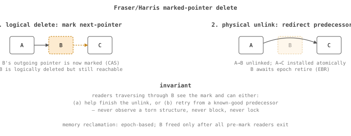

+++
title = "splay-list, part 1: Fraser/Harris in C macros"
date = "2026-06-22"
draft = true
description = "A header-only, lock-free skip-list generated entirely through C preprocessor macros."
[taxonomies]
tags = ["skiplist","concurrency","lock-free","c","series:skiplist"]
+++

**Status: draft, scaffolded by an agent. Prose to be written by me.**

## thesis

A header-only, lock-free skip-list using the Fraser/Harris marked-pointer
technique with epoch-based reclamation, generated entirely through C
preprocessor macros. Why C macros are the right choice for type-specific
generation when C++ templates aren't on the table.

## outline

- [ ] The lock-free skip-list algorithm in three pictures: insert, delete,
      mark.
- [ ] Why marked pointers and how they survive concurrent traversal.
- [ ] Memory reclamation: EBR vs hazard pointers vs RCU. Why EBR for this.
- [ ] Walking through the macro expansion: what `SL_DECLARE` actually
      generates. Show the preprocessed output for a small declaration.
- [ ] Single-threaded compile-time switch — what falls away when you don't
      need atomics.

## source material

- `~/ws/skiplist/include/sl.h` — the library is the spec.
- `~/ws/skiplist/DESIGN.md` — design rationale.
- `~/ws/skiplist/AGENTS.md` — author notes.

## open questions for me to answer

- Cite the original Fraser thesis and the Harris paper. Find page numbers.
- Pick a representative concrete user (will I land it in pg_tre? in dbsql?
  somewhere else?) and link.
