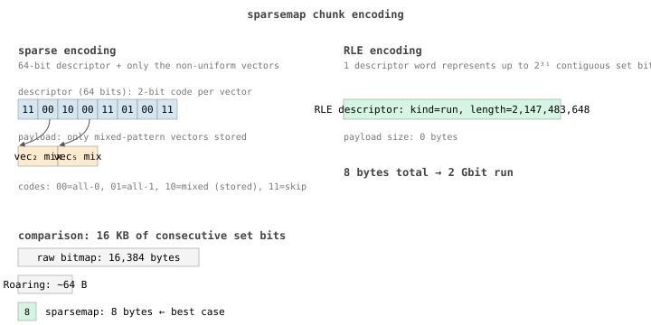

+++
title = "sparsemap, part 2: the encoding"
date = "2026-06-08"
draft = true
description = "How a 64-bit descriptor plus sparse / RLE encoding compresses 16 KB of set bits into 8 bytes."
[taxonomies]
tags = ["sparsemap","bitmaps","postgres","series:sparsemap"]
+++

**Status: draft, scaffolded by an agent. Prose to be written by me.**

## thesis

A walk through the 64-bit descriptor format, the sparse-vs-RLE per-vector
decision, and the math that makes "16 KB of consecutive set bits in 8 bytes"
the best case. The encoding is small enough to fit in a blog post and
self-describing enough to read in `xxd`.

## outline

- [ ] Descriptor layout: 32 vector slots × 2-bit code (00 / 01 / 10 / 11).
- [ ] Sparse encoding: uniform vectors take zero payload, only mixed vectors
      stored.
- [ ] RLE encoding: a single 64-bit descriptor for a contiguous run; 2-billion
      bits in 8 bytes.
- [ ] Worst case (random bits) = raw bitmap + 8 bytes overhead. Why "no worse
      than the bitmap you would have written anyway" is good enough.
- [ ] How insertions / deletions transition between encodings.
- [ ] The diagram (`encoding.svg` lives next to this post — embed it).

## source material

- `~/ws/sparsemap/include/sparsemap.h` — the layout, well commented.
- `~/ws/sparsemap/docs/ARCHITECTURE.md` — design rationale.

## open questions for me to answer

- Decide whether to show actual `xxd` output of a real chunk. Probably yes.
- Pick concrete worked examples — which pattern of bits to walk through?
